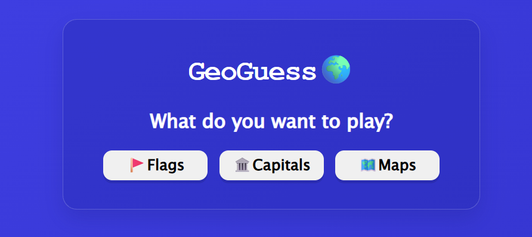

# 🌍 GeoGuess 🌍

A fun and interactive geography quiz game built with HTML, CSS, and JavaScript!

Test your geography knowledge by guessing countries from their **flags, capitals, and maps** across different regions of the world.

## 🎮 Game Modes

- 🚩 **Flags** — Guess the country from its flag
- 🏛️ **Capitals** — Guess the capital of a country
- 🗺️ **Maps** — Guess the country from its map shape

## ✨ Features

- 🌍 **195 countries**
- 🌎 Play by region or choose **ALL**
- 🔢 Choose how many questions you want to play
- 😌 **Easy**, 😎 **Normal**, and 😈 **Hard** difficulties
- ⏱️ Question timer
- 🎯 Score tracking
- 🔥 Streak system
- 🏆 High scores
- 📊 Game Over statistics
- 🔊 Sound effects with mute/unmute
- ✨ Animations and visual feedback
- 📱 Responsive design for different screen sizes
- 🚪 Quit Game and navigation controls

## 🌎 Regions

- 🇪🇺 Europe
- 🌍 Africa
- 🌏 Asia
- 🌎 North America
- 🌎 South America
- 🌊 Oceania
- 🌐 All Countries

## 🛠️ Made With

- HTML
- CSS
- JavaScript

## 🚀 Play

You can play GeoGuess here:

https://kevinhuskykb.github.io/GeoGuess/

## 💻 About

I made GeoGuess while learning and improving my JavaScript skills.

This project helped me practice working with things like arrays, objects, functions, DOM manipulation, event handling, timers, local storage, responsive design, and building a larger game with multiple modes and screens.

It's one of my larger JavaScript projects so far! 🌍🚀
